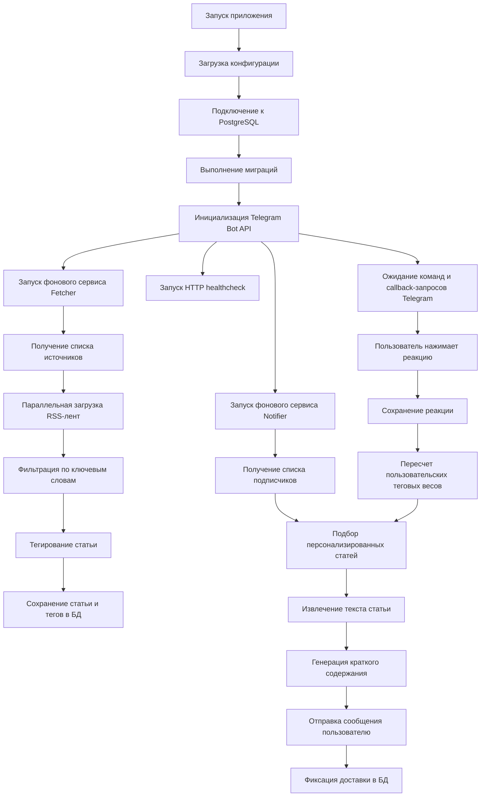
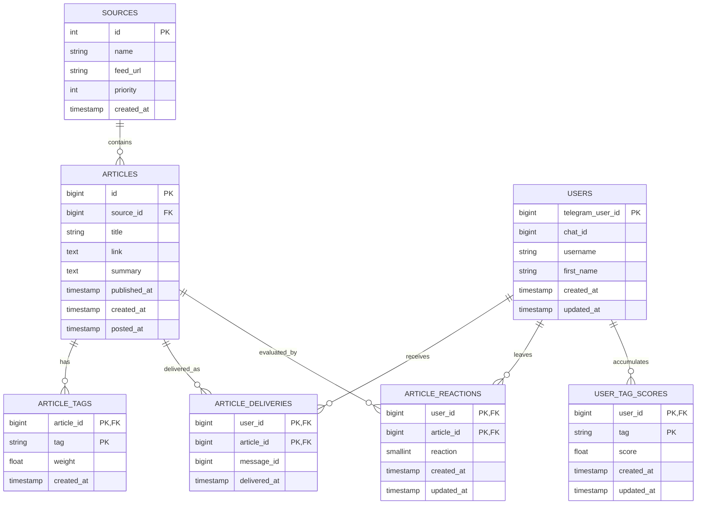

# Отчет по проекту `gamenewspeach_bot`

## Глава 1. Общая характеристика проекта

Содержимое первой главы в рамках текущей редакции отчета намеренно опущено. Данный раздел может быть впоследствии дополнен постановкой задачи, анализом предметной области, обоснованием актуальности разработки и формулировкой требований к программной системе.

## Глава 2. Моделирование бизнес-процесса и проектирование базы данных

### 2.1. Общая логика функционирования системы

Проект `gamenewspeach_bot` представляет собой Telegram-бота, предназначенного для автоматизированного сбора новостей игровой индустрии, их сохранения в базе данных, интеллектуального тегирования, генерации краткого содержания и последующей персонализированной доставки пользователям. В отличие от простых каналов публикации новостей, данная система опирается на механизм обратной связи: реакции пользователя на полученные публикации накапливаются в базе данных и используются для уточнения дальнейших рекомендаций.

С точки зрения архитектуры система объединяет несколько взаимосвязанных контуров:

1. контур загрузки конфигурации и инициализации сервисов;
2. контур периодического сбора RSS-новостей;
3. контур семантической обработки материала;
4. контур хранения структурированных данных в PostgreSQL;
5. контур персонализированной рассылки в Telegram;
6. контур корректировки пользовательского профиля на основании реакций.

Таким образом, приложение реализует непрерывный цикл обработки данных: от внешнего источника новостей до адресной доставки материала конечному пользователю.

### 2.2. Процессная схема работы системы

Ниже приведена схема, близкая по смыслу к BPMN-описанию, отражающая последовательность основных этапов функционирования программного комплекса.



Приведенная схема показывает, что приложение не является линейной программой с однократным выполнением. Напротив, оно представляет собой событийно-ориентированную систему, в которой параллельно работают фоновые процессы сбора данных и их доставки, а также интерактивный контур взаимодействия с пользователем.

### 2.3. Уточненная декомпозиция бизнес-процесса

Для более детального понимания предметной логики процесс работы системы можно представить в виде последовательности этапов.

#### Этап 1. Инициализация

После запуска приложение получает настройки из переменных окружения и, при необходимости, из HCL-файлов конфигурации. Далее выполняется подключение к PostgreSQL, после чего автоматически применяются миграции схемы данных. Такой подход позволяет системе поддерживать актуальную структуру таблиц без ручного вмешательства администратора.

#### Этап 2. Сбор новостей

Сервис `Fetcher` периодически обращается к таблице `sources`, извлекает перечень RSS-источников и для каждого источника запускает процедуру загрузки новостной ленты. Полученные элементы анализируются, нормализуются по времени публикации и проходят фильтрацию по нежелательным ключевым словам.

#### Этап 3. Семантическое обогащение

Каждая релевантная статья проходит через модуль тегирования. В системе применяется комбинированный подход:

1. извлечение тегов из категорий RSS;
2. детекция тегов по словарю ключевых фраз;
3. дополнительное уточнение с помощью модели OpenAI.

В результате каждая статья получает набор тегов с весами, отражающими значимость соответствующей тематической характеристики.

#### Этап 4. Хранение

Новость сохраняется в таблицу `articles`, а связанные с ней тематические признаки помещаются в таблицу `article_tags`. Благодаря этому становится возможным не только хранить новости как текстовые записи, но и использовать их как элементы рекомендательной модели.

#### Этап 5. Персонализированная доставка

Сервис `Notifier` получает список подписчиков из таблицы `users` и для каждого пользователя выполняет персонализированный подбор новости. Отбор основывается на сопоставлении тегов статьи с накопленными весами интересов пользователя в таблице `user_tag_scores`. После выбора подходящего материала система извлекает его содержимое, формирует краткое резюме и отправляет сообщение в Telegram.

#### Этап 6. Получение обратной связи

Пользователь может оценить новость с помощью кнопок реакции. Нажатие кнопки инициирует callback-запрос, который обрабатывается ботом, фиксируется в таблице `article_reactions` и приводит к пересчету индивидуальных теговых коэффициентов пользователя. Тем самым реализуется механизм адаптивного самообучения рекомендательной подсистемы.

### 2.4. Проектирование базы данных

В основе проекта лежит реляционная база данных PostgreSQL. Структура БД построена таким образом, чтобы одновременно решать две задачи:

1. обеспечивать надежное хранение новостных записей и параметров источников;
2. поддерживать персонализированный рекомендательный контур на основе реакций пользователей.

Система содержит следующие основные таблицы:

1. `sources`
2. `articles`
3. `users`
4. `article_tags`
5. `article_deliveries`
6. `article_reactions`
7. `user_tag_scores`
8. `schema_migrations`

### 2.5. Логическая схема связей между таблицами



### 2.6. Описание таблиц

#### Таблица `sources`

Таблица предназначена для хранения списка новостных источников. Каждая запись описывает один RSS-канал, который используется системой при периодическом сборе новостей.

```text
+------------+--------------+-----------------------------------------------+
| Поле       | Тип          | Назначение                                    |
+------------+--------------+-----------------------------------------------+
| id         | SERIAL PK    | Уникальный идентификатор источника            |
| name       | VARCHAR(255) | Наименование источника                        |
| feed_url   | VARCHAR(255) | URL RSS-ленты                                 |
| priority   | INT          | Приоритет источника при ранжировании          |
| created_at | TIMESTAMP    | Дата и время добавления записи                |
+------------+--------------+-----------------------------------------------+
```

#### Таблица `articles`

Таблица содержит собранные новости. Каждая статья связана с конкретным источником.

```text
+--------------+--------------+---------------------------------------------------+
| Поле         | Тип          | Назначение                                        |
+--------------+--------------+---------------------------------------------------+
| id           | BIGSERIAL PK | Идентификатор статьи                              |
| source_id    | BIGINT FK    | Ссылка на источник новости                        |
| title        | VARCHAR(255) | Заголовок статьи                                  |
| link         | TEXT UNIQUE  | Уникальная ссылка на материал                     |
| summary      | TEXT         | Краткий исходный текст или описание               |
| published_at | TIMESTAMP    | Время публикации статьи у внешнего источника      |
| created_at   | TIMESTAMP    | Время сохранения статьи в локальной системе       |
| posted_at    | TIMESTAMP    | Историческое поле публикации, сохраненное в схеме |
+--------------+--------------+---------------------------------------------------+
```

#### Таблица `users`

Данная таблица отражает подписчиков, взаимодействующих с ботом через команду `/start`.

```text
+------------------+--------------+----------------------------------------------+
| Поле             | Тип          | Назначение                                   |
+------------------+--------------+----------------------------------------------+
| telegram_user_id | BIGINT PK    | Идентификатор пользователя Telegram          |
| chat_id          | BIGINT       | Идентификатор чата для отправки сообщений    |
| username         | VARCHAR(255) | Имя пользователя в Telegram                  |
| first_name       | VARCHAR(255) | Отображаемое имя                             |
| created_at       | TIMESTAMP    | Время первой регистрации                     |
| updated_at       | TIMESTAMP    | Время последнего обновления профиля          |
+------------------+--------------+----------------------------------------------+
```

#### Таблица `article_tags`

Таблица реализует связь между статьей и ее тематическими признаками.

```text
+------------+------------------+------------------------------------------------+
| Поле       | Тип              | Назначение                                     |
+------------+------------------+------------------------------------------------+
| article_id | BIGINT PK, FK    | Ссылка на статью                               |
| tag        | VARCHAR(120) PK  | Имя тега                                       |
| weight     | DOUBLE PRECISION | Вес тега в контексте статьи                    |
| created_at | TIMESTAMP        | Время создания записи                          |
+------------+------------------+------------------------------------------------+
```

#### Таблица `article_deliveries`

Таблица фиксирует факт доставки конкретной статьи конкретному пользователю. Она препятствует повторной отправке одного и того же материала.

```text
+--------------+--------------+------------------------------------------------+
| Поле         | Тип          | Назначение                                     |
+--------------+--------------+------------------------------------------------+
| user_id      | BIGINT PK FK | Пользователь-получатель                        |
| article_id   | BIGINT PK FK | Доставленная статья                            |
| message_id   | BIGINT       | Идентификатор сообщения в Telegram             |
| delivered_at | TIMESTAMP    | Время отправки                                 |
+--------------+--------------+------------------------------------------------+
```

#### Таблица `article_reactions`

Таблица хранит оценку пользователя по отношению к статье. Допустимы два значения реакции: `1` и `-1`.

```text
+------------+--------------+------------------------------------------------+
| Поле       | Тип          | Назначение                                     |
+------------+--------------+------------------------------------------------+
| user_id    | BIGINT PK FK | Пользователь                                   |
| article_id | BIGINT PK FK | Оцененная статья                               |
| reaction   | SMALLINT     | Положительная или отрицательная реакция        |
| created_at | TIMESTAMP    | Время первой фиксации реакции                  |
| updated_at | TIMESTAMP    | Время последнего обновления                    |
+------------+--------------+------------------------------------------------+
```

#### Таблица `user_tag_scores`

Это ключевая таблица рекомендательного механизма. В ней аккумулируются численные интересы пользователя по тематическим тегам.

```text
+------------+------------------+------------------------------------------------+
| Поле       | Тип              | Назначение                                     |
+------------+------------------+------------------------------------------------+
| user_id    | BIGINT PK FK     | Пользователь                                   |
| tag        | VARCHAR(120) PK  | Тематический признак                           |
| score      | DOUBLE PRECISION | Накопленный вес интереса                       |
| created_at | TIMESTAMP        | Время создания записи                          |
| updated_at | TIMESTAMP        | Время последнего пересчета                     |
+------------+------------------+------------------------------------------------+
```

#### Таблица `schema_migrations`

Служебная таблица создается приложением автоматически и используется для учета уже выполненных миграций. Она обеспечивает воспроизводимость структуры БД при развертывании.

### 2.7. Характер связей между таблицами

Модель данных имеет ярко выраженную иерархическую и событийную природу.

1. Один источник (`sources`) может порождать множество статей (`articles`).
2. Одна статья (`articles`) может содержать множество тегов (`article_tags`).
3. Один пользователь (`users`) может получить множество статей через таблицу доставок (`article_deliveries`).
4. Один пользователь (`users`) может оставить множество реакций на разные статьи (`article_reactions`).
5. Пользовательский профиль интересов (`user_tag_scores`) формируется агрегированно на основе реакций и тегов статей.

Именно сочетание нормализованного новостного ядра (`sources`, `articles`) и адаптивного пользовательского контура (`users`, `article_reactions`, `user_tag_scores`) позволяет системе реализовать персонализированную рассылку без выделенного внешнего рекомендательного сервиса.

## Глава 3. Основные алгоритмы, интеграционные механизмы и контейнеризация

### 3.1. Общая архитектура программного решения

Архитектура проекта относится к классу монолитных приложений и более точно может быть охарактеризована как модульный монолит. Все ключевые подсистемы, включая обработку Telegram-команд, сбор новостных данных, тегирование материалов, генерацию кратких описаний, рекомендательную логику и доступ к базе данных, реализованы в составе одного исполняемого приложения и работают в рамках единого процесса.

Вместе с тем данный монолит нельзя считать неструктурированным. Внутреннее устройство системы построено по модульному принципу, при котором отдельные функциональные области вынесены в самостоятельные логические компоненты. Так, модуль `bot` отвечает за взаимодействие с Telegram, `fetcher` реализует периодический сбор новостей, `notifier` обеспечивает персонализированную доставку сообщений, `tagger` и `summary` инкапсулируют работу с нейросетевыми механизмами, а `storage` концентрирует операции доступа к PostgreSQL. Подобное разделение ответственности повышает сопровождаемость решения и упрощает дальнейшее развитие проекта.

С точки зрения характера выполнения приложение сочетает признаки слоистой и событийно-ориентированной архитектуры. С одной стороны, в нем явно выделяются инфраструктурный уровень, уровень доступа к данным и уровень прикладной логики. С другой стороны, значительная часть операций инициируется событиями двух типов: внешними пользовательскими действиями в Telegram и внутренними периодическими триггерами, запускающими сбор и рассылку новостей. Следовательно, проект следует рассматривать как модульный монолит с событийно-ориентированной моделью исполнения.

Для большей наглядности архитектурную организацию системы можно представить в виде трех взаимодополняющих проекций: слоистой, сервисно-модульной и событийной.

#### 3.1.1. Слоистое представление архитектуры

С позиций слоистой архитектуры приложение разделяется на несколько уровней, каждый из которых выполняет собственную группу функций и взаимодействует с соседними уровнями через четко определенные программные интерфейсы.

```text
Внешние источники и клиенты
RSS-ленты | Telegram API | OpenAI API | HTTP healthcheck
                    |
                    v
+-----------------------------------------------------------+
| Слой внешнего взаимодействия                              |
| bot, botkit, callback handlers, HTTP endpoint             |
+-----------------------------------------------------------+
                    |
                    v
+-----------------------------------------------------------+
| Слой прикладной логики                                    |
| fetcher, notifier, tagger, summary, config                |
+-----------------------------------------------------------+
                    |
                    v
+-----------------------------------------------------------+
| Слой доступа к данным                                     |
| storage, SQL-запросы, миграции                            |
+-----------------------------------------------------------+
                    |
                    v
+-----------------------------------------------------------+
| Инфраструктурный слой                                     |
| PostgreSQL, Docker, docker-compose, файловая конфигурация |
+-----------------------------------------------------------+
```

В рамках такого подхода верхний уровень отвечает за прием и передачу данных внешнему миру, прикладной уровень концентрирует бизнес-логику, слой доступа к данным инкапсулирует операции хранения, а инфраструктурный слой обеспечивает среду исполнения. Подобная декомпозиция делает систему более прозрачной с точки зрения сопровождения и тестирования.

#### 3.1.2. Сервисно-модульное представление архитектуры

Несмотря на монолитную форму развертывания, внутренняя организация проекта построена по сервисно-модульному принципу. Это означает, что отдельные функциональные подсистемы выделены в логически самостоятельные компоненты, каждый из которых обслуживает собственный участок предметной области.

```text
+-------------------+    +-------------------+    +-------------------+
| Telegram-модуль   |    | Сервис сбора      |    | Сервис рассылки   |
| bot, botkit       |    | fetcher           |    | notifier          |
+-------------------+    +-------------------+    +-------------------+
          |                         |                         |
          +------------+------------+------------+------------+
                       |                         |
                       v                         v
              +-------------------+    +-------------------+
              | AI-модули         |    | Слой хранения     |
              | tagger, summary   |    | storage           |
              +-------------------+    +-------------------+
```

Содержательно данная схема интерпретируется следующим образом:

1. модуль `bot` обеспечивает взаимодействие с Telegram и маршрутизацию команд;
2. модуль `fetcher` отвечает за получение и первичную обработку новостного потока;
3. модуль `notifier` реализует персонализированную доставку сообщений;
4. модули `tagger` и `summary` инкапсулируют интеллектуальную обработку текста;
5. модуль `storage` скрывает детали работы с PostgreSQL и транзакциями.

Такое построение позволяет развивать отдельные части приложения независимо на уровне исходного кода, не превращая проект в набор распределенных микросервисов.

#### 3.1.3. Событийная модель исполнения

С точки зрения динамики выполнения проект обладает событийно-ориентированной природой. Поведение системы формируется не одной линейной последовательностью операторов, а совокупностью независимых событийных контуров.

```text
События запуска:
загрузка конфигурации -> подключение к БД -> миграции -> старт сервисов

Периодические события:
таймер fetcher -> загрузка RSS -> сохранение статей
таймер notifier -> подбор рекомендаций -> отправка сообщений

Пользовательские события:
команда /start -> регистрация пользователя
callback реакции -> сохранение оценки -> пересчет профиля интересов
```

Следовательно, в статическом аспекте система является модульным монолитом, а в динамическом аспекте представляет собой событийно-ориентированное приложение с несколькими параллельно функционирующими контурами обработки.

Логика приложения организована вокруг главной функции, которая последовательно инициализирует инфраструктурные зависимости, а затем запускает параллельно несколько рабочих контуров: обработчик Telegram-команд, сервис сбора новостей, сервис рассылки и HTTP healthcheck.

Ключевой фрагмент инициализации имеет следующий вид:

```go
db, err := connectDB(config.Get().DatabaseDSN)
if err != nil {
	log.Printf("[ERROR] failed to connect to db: %v", err)
	return
}
defer db.Close()

if err := storage.Migrate(context.Background(), db); err != nil {
	log.Printf("[ERROR] failed to migrate db: %v", err)
	return
}

articleStorage := storage.NewArticleStorage(db)
sourceStorage := storage.NewSourceStorage(db)
userStorage := storage.NewUserStorage(db)
tagger := tagger.New(config.Get().OpenAIKey, config.Get().OpenAIModel)
summarizer := summary.NewOpenAISummarizer(
	config.Get().OpenAIKey,
	config.Get().OpenAIModel,
	config.Get().OpenAIPrompt,
)
```

Приведенный код демонстрирует важную особенность проекта: база данных не просто используется для хранения, но является центральной опорой всего жизненного цикла приложения. Через нее проходят и конфигурация источников, и накопление пользовательского профиля, и журнализация доставок.

Таким образом, архитектурная модель данного проекта не является микросервисной, поскольку отдельные функциональные подсистемы не вынесены в независимые сетевые сервисы, не имеют собственных автономных процессов жизненного цикла и не взаимодействуют друг с другом через межсервисные протоколы. Наличие контейнера базы данных в `Docker Compose` не изменяет архитектурный класс приложения, а лишь описывает инфраструктурный способ локального развертывания монолитной системы.

### 3.2. Алгоритм подключения к базе данных и миграции схемы

Перед запуском бизнес-логики приложение формирует соединение с PostgreSQL. При неудачном подключении к хосту `db` предусмотрен резервный сценарий, ориентированный на локальную разработку, когда база может быть опубликована на `localhost:5433`.

```go
func connectDB(dsn string) (*sqlx.DB, error) {
	db, err := sqlx.Connect("postgres", dsn)
	if err == nil {
		return db, nil
	}

	fallbackDSN, ok := localhostFallbackDSN(dsn)
	if !ok {
		return nil, err
	}

	db, fallbackErr := sqlx.Connect("postgres", fallbackDSN)
	if fallbackErr == nil {
		return db, nil
	}

	return nil, errors.Join(err, fallbackErr)
}
```

После установления соединения выполняется функция `storage.Migrate`, которая читает SQL-файлы, встроенные в бинарный файл через `embed`, и последовательно применяет только те миграции, которые еще не отмечены в служебной таблице `schema_migrations`. Такой подход особенно важен в контейнерной среде, поскольку исключает рассинхронизацию между кодом приложения и схемой данных.

### 3.3. Алгоритм сбора новостей

Сервис `Fetcher` реализует периодический цикл опроса RSS-источников. Его работа начинается сразу после запуска приложения и продолжается до завершения общего контекста.

```go
func (f *Fetcher) Start(ctx context.Context) error {
	ticker := time.NewTicker(f.fetchInterval)
	defer ticker.Stop()

	if err := f.Fetch(ctx); err != nil {
		return err
	}

	for {
		select {
		case <-ctx.Done():
			return ctx.Err()
		case <-ticker.C:
			if err := f.Fetch(ctx); err != nil {
				return err
			}
		}
	}
}
```

На каждом шаге сервис извлекает список источников из БД и обрабатывает их параллельно. Параллелизм обеспечивает более эффективное использование времени ожидания сетевых запросов к внешним RSS-лентам.

```go
for _, source := range sources {
	wg.Add(1)

	go func(source Source) {
		defer wg.Done()

		items, err := source.Fetch(ctx)
		if err != nil {
			log.Printf("[ERROR] failed to fetch items from source %q: %v", source.Name(), err)
			return
		}

		if err := f.processItems(ctx, source, items); err != nil {
			log.Printf("[ERROR] failed to process items from source %q: %v", source.Name(), err)
		}
	}(src.NewRSSSourceFromModel(source))
}
```

Смысл данного алгоритма заключается в том, что каждая RSS-лента представляет независимый поток данных. Следовательно, их конкурентная обработка является естественным способом сокращения общего времени цикла сбора.

### 3.4. Алгоритм фильтрации и сохранения новостей

После загрузки элементов новостной ленты система последовательно выполняет нормализацию даты публикации, фильтрацию по нежелательным ключевым словам и тегирование статьи. Если материал удовлетворяет условиям отбора, он сохраняется в БД.

```go
func (f *Fetcher) processItems(ctx context.Context, source Source, items []model.Item) error {
	for _, item := range items {
		item.Date = item.Date.UTC()

		if f.itemShouldBeSkipped(item) {
			continue
		}

		tags, err := f.tagger.Tags(ctx, item)
		if err != nil {
			log.Printf("[WARN] failed to tag item %q: %v", item.Title, err)
		}

		if err := f.articles.Store(ctx, model.Article{
			SourceID:    source.ID(),
			Title:       item.Title,
			Link:        item.Link,
			Summary:     item.Summary,
			Tags:        tags,
			PublishedAt: item.Date,
		}); err != nil {
			return err
		}
	}

	return nil
}
```

Фильтрация строится на сравнении категорий и заголовка статьи с перечнем ключевых слов, заданных в конфигурации. Это позволяет исключать материалы, не соответствующие целям информационной ленты.

### 3.5. Взаимодействие с базой данных при сохранении статей

Сохранение статьи организовано как транзакционный процесс. Сначала запись добавляется в таблицу `articles`, а затем для нее создаются связанные записи в таблице `article_tags`. Благодаря транзакции обеспечивается целостность: статья и ее тематические признаки появляются в БД согласованно.

```go
tx, err := conn.BeginTxx(ctx, nil)
if err != nil {
	return err
}

row := tx.QueryRowxContext(
	ctx,
	`INSERT INTO articles (source_id, title, link, summary, published_at)
	 VALUES ($1, $2, $3, $4, $5)
	 ON CONFLICT (link) DO UPDATE SET
	 	source_id = EXCLUDED.source_id
	 RETURNING id;`,
	article.SourceID,
	article.Title,
	article.Link,
	article.Summary,
	article.PublishedAt,
)
```

Здесь важно отметить применение `ON CONFLICT (link)`. Такое решение защищает систему от дублирования новостей, если внешний RSS-источник повторно вернет уже обработанный материал.

### 3.6. Взаимодействие с нейросетями: тегирование

Модуль `tagger` представляет собой пример гибридного алгоритма, в котором эвристики и нейросетевая модель работают совместно. Сначала формируется базовый набор тегов из RSS-категорий и ключевых слов. Затем, если в конфигурации задан API-ключ OpenAI, выполняется дополнительный запрос к модели.

```go
request := openai.ChatCompletionRequest{
	Model: t.model,
	Messages: []openai.ChatCompletionMessage{
		{Role: openai.ChatMessageRoleSystem, Content: systemPrompt},
		{Role: openai.ChatMessageRoleUser, Content: userPrompt},
	},
	MaxTokens:   300,
	Temperature: 0.2,
}
```

Нейросетевая модель получает заголовок, категории и краткое содержание материала, после чего возвращает JSON-структуру с тегами и весами. Эти данные затем нормализуются и объединяются с тегами, полученными детерминированным способом.

Подобная архитектура заслуживает отдельного внимания по двум причинам:

1. даже при недоступности OpenAI базовая функциональность не прекращает работу;
2. при наличии доступа к модели качество семантического описания статьи заметно возрастает.

Если API возвращает ошибку квоты или ограничение по частоте запросов, система отключает AI-тегирование и продолжает функционировать в резервном режиме.

### 3.7. Взаимодействие с нейросетями: суммаризация текста

Помимо тегирования, система использует OpenAI для генерации краткого пересказа новости перед отправкой пользователю. Алгоритм работы следующий:

1. если у статьи уже есть поле `summary`, используется оно;
2. если краткого описания нет, приложение загружает материал по URL;
3. из HTML извлекается основной текст статьи;
4. текст очищается от избыточных переносов строк;
5. очищенный материал передается в OpenAI-модель для суммаризации.

```go
doc, err := readability.FromReader(r, nil)
if err != nil {
	return "", err
}

summary, err := n.summarizer.Summarize(cleanupText(doc.TextContent))
if err != nil {
	return "", err
}
```

Сама функция суммаризации формирует запрос в модель на основе системного промпта, задаваемого через конфигурацию:

```go
request := openai.ChatCompletionRequest{
	Model: s.model,
	Messages: []openai.ChatCompletionMessage{
		{Role: openai.ChatMessageRoleSystem, Content: s.prompt},
		{Role: openai.ChatMessageRoleUser, Content: text},
	},
	MaxTokens:   1024,
	Temperature: 1,
	TopP:        1,
}
```

В результате система не просто пересылает ссылку на новость, а формирует компактное и пригодное для быстрого ознакомления сообщение.

### 3.8. Алгоритм персонализированной рассылки

Сервис `Notifier` периодически получает список подписчиков и подбирает для каждого пользователя одну наиболее релевантную статью. Выбор строится на SQL-запросе, который учитывает:

1. теги статьи;
2. накопленные веса интересов пользователя;
3. приоритет источника;
4. новизну публикации;
5. отсутствие факта предыдущей доставки.

Основной запрос имеет следующий вид:

```sql
SELECT
    a.id AS a_id,
    s.priority AS s_priority,
    COALESCE(SUM(ats.weight * uts.score), 0) AS recommendation_score
FROM articles a
JOIN sources s ON s.id = a.source_id
LEFT JOIN article_tags ats ON ats.article_id = a.id
LEFT JOIN user_tag_scores uts ON uts.user_id = $1 AND uts.tag = ats.tag
LEFT JOIN article_deliveries ad ON ad.user_id = $1 AND ad.article_id = a.id
WHERE ad.article_id IS NULL
  AND a.published_at >= $2::timestamp
GROUP BY a.id, s.priority
ORDER BY recommendation_score DESC, s.priority DESC, a.published_at DESC, a.created_at DESC
LIMIT $3;
```

Формально это означает, что рейтинг статьи для пользователя вычисляется как сумма произведений весов тегов статьи на пользовательские оценки интереса по тем же тегам. Если у пользователя еще нет накопленного профиля, отбор переходит к более общим признакам: приоритету источника и свежести новости.

После выбора материала сообщение отправляется в Telegram вместе с кнопками реакций:

```go
msg := tgbotapi.NewMessage(user.ChatID, formatArticle(article, summary))
msg.ParseMode = "MarkdownV2"
msg.ReplyMarkup = reactionKeyboard(article.ID)

sentMessage, err := n.bot.Send(msg)
if err != nil {
	return err
}

return n.articles.RecordDelivery(ctx, user.TelegramUserID, article.ID, sentMessage.MessageID)
```

### 3.9. Алгоритм обработки пользовательских реакций

После получения пользователем статьи система ожидает возможную реакцию в виде callback-события. Реакция интерпретируется как числовой сигнал:

1. `like` преобразуется в `+1`;
2. `dislike` преобразуется в `-1`.

Затем сервис вычисляет приращение `delta`, позволяющее корректно обрабатывать изменение ранее сохраненной оценки, и обновляет профиль тегов пользователя:

```go
delta := reaction
if previous.Valid {
	delta -= int(previous.Int16)
}

INSERT INTO user_tag_scores (user_id, tag, score)
SELECT $1, at.tag, at.weight * $2
FROM article_tags at
WHERE at.article_id = $3
ON CONFLICT (user_id, tag) DO UPDATE SET
    score = user_tag_scores.score + EXCLUDED.score,
    updated_at = NOW();
```

Именно этот механизм делает систему адаптивной. Положительная реакция усиливает значения тегов, связанных со статьей, а отрицательная реакция, напротив, ослабляет соответствующие интересы. В результате каждый следующий акт рассылки в большей степени соответствует предпочтениям конкретного пользователя.

### 3.10. Telegram-взаимодействие и прикладной интерфейс

Проект использует Telegram не только как транспорт сообщений, но и как полноценный пользовательский интерфейс. Через команду `/start` пользователь регистрируется в системе, а административные команды позволяют управлять источниками новостей. Отдельно реализована регистрация callback-обработчика для реакций.

```go
newsBot.RegisterCmdView("start", bot.ViewCmdStart(userStorage))
newsBot.RegisterCmdView("addsource", middleware.AdminsOnly(...))
newsBot.RegisterCmdView("listsources", middleware.AdminsOnly(...))
newsBot.RegisterCallbackView("reaction:", bot.ViewCallbackReaction(articleStorage))
```

Таким образом, бот объединяет административный контур управления и пользовательский контур получения рекомендаций в рамках единого интерфейса обмена сообщениями.

### 3.11. Контейнеризация и Docker-инфраструктура

Для развертывания проекта используется `Dockerfile`, а для локального запуска в составе нескольких сервисов применяется `docker-compose.local.yml`.

Текущий `Dockerfile` имеет следующий вид:

```dockerfile
FROM golang:1.20-alpine AS builder

WORKDIR /app

COPY go.mod go.sum ./
RUN go mod download

COPY internal ./internal
COPY cmd ./cmd

RUN go build -buildvcs=false -o /app/news-feed-bot ./cmd/

EXPOSE 8080

CMD ["/app/news-feed-bot"]
```

Данный файл реализует сборку приложения внутри контейнера на базе `golang:1.20-alpine`. Особого внимания заслуживает параметр `-buildvcs=false`, который обеспечивает устойчивость сборки в средах, где Git-метаданные могут быть недоступны.

Файл `docker-compose.local.yml` описывает совместный запуск двух сервисов: PostgreSQL и бота.

```yaml
services:
  db:
    image: postgres:15
    environment:
      POSTGRES_USER: postgres
      POSTGRES_PASSWORD: postgres
      POSTGRES_DB: news_feed_bot
    healthcheck:
      test: ["CMD-SHELL", "pg_isready -U postgres -d news_feed_bot"]

  bot:
    build:
      context: .
    environment:
      NFB_DATABASE_DSN: ${NFB_DATABASE_DSN:-postgres://postgres:postgres@db:5432/news_feed_bot?sslmode=disable}
      NFB_TELEGRAM_BOT_TOKEN: ${NFB_TELEGRAM_BOT_TOKEN}
      NFB_OPENAI_KEY: ${NFB_OPENAI_KEY}
      NFB_OPENAI_PROMPT: ${NFB_OPENAI_PROMPT}
      NFB_OPENAI_MODEL: ${NFB_OPENAI_MODEL}
    depends_on:
      db:
        condition: service_healthy
```

Данная конфигурация особенно важна для локальной разработки, поскольку:

1. запускает БД и приложение как согласованный набор сервисов;
2. ожидает готовности PostgreSQL перед стартом бота;
3. централизованно передает переменные окружения для доступа к Telegram и OpenAI.

### 3.12. Выводы по третьей главе

Рассмотренный проект представляет собой интеграцию нескольких важных инженерных подходов: событийной архитектуры, реляционного хранения данных, рекомендательных алгоритмов, нейросетевой обработки текста и контейнерного развертывания. Его практическая ценность заключается в том, что он сочетает относительно простую по форме пользовательскую точку входа, а именно Telegram-бота, с достаточно насыщенной внутренней логикой обработки данных.

С технической точки зрения наиболее значимыми особенностями решения являются:

1. автоматизированное применение миграций при запуске;
2. конкурентный сбор новостей из множества источников;
3. гибридное тегирование на основе правил и модели OpenAI;
4. суммаризация новостей перед отправкой пользователю;
5. адаптивный рекомендательный контур на основе реакций;
6. воспроизводимое локальное развертывание через Docker Compose.

Все перечисленные свойства позволяют рассматривать `gamenewspeach_bot` не как экспериментальный скрипт, а как полноценную прикладную информационную систему с четко выраженной архитектурой и потенциалом дальнейшего развития.
